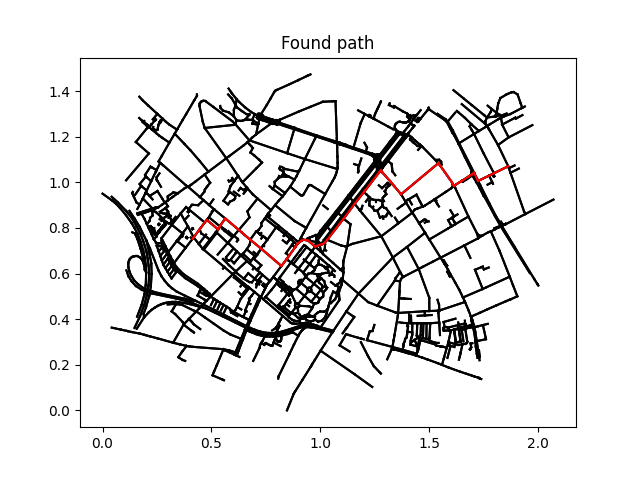

# Bonn Shortest Path Finder


An efficient routing engine that visualizes the street network of Bonn, Germany, and computes the shortest path between nodes using a vectorized **Dijkstra's Algorithm** and **Breadth-First Search (BFS)** for graph validation.



## Core Features
* **Graph Validation (BFS):** Pre-checks the network topology to detect detached road networks (*connected components*) in $O(1)$ time complexity using Python `set` hashing.
* **Vectorized Dijkstra:** Optimized shortest-path computation utilizing NumPy vectorization (`np.argmin`, `np.where`). Includes an *Early Exit* strategy to handle unperfect real-world GIS data.
* **Automated Logging:** Serializes the internal graph structure and highlights topology warnings into an auto-generated `graph_structure.txt`.
* **Visual Mapping:** Dynamic rendering of the entire graph and highlighted route using Matplotlib.

## Tech Stack & Architecture
* **Python 3** (Object-Oriented Architecture)
* **NumPy** (Vectorized Array Operations)
* **Matplotlib** (Graph Rendering & Geometry Plotting)

```text
├── Main.py              # Application Entry Point & Exception Handling
├── Search.py            # Graph Algorithms (BFS & Dijkstra)
├── Graph.py             # Custom Data Parser (Nodes, Neighbors, Matrices)
├── path_bonn.png        # Image of a successful route calculation
├── graph.txt            # Geospatial Source Data: Edge connections
├── xcoords.txt          # Geospatial Source Data: X-Coordinates
└── ycoords.txt          # Geospatial Source Data: Y-Coordinates
```

## Installation & Usage
1. Clone the repository:
```bash 
git clone [https://github.com/m-podolski-projects/bonn-path-finder.git](https://github.com/m-podolski-projects/bonn-path-finder.git)
cd bonn-path-finder
```

2. Install dependencies:
```bash 
pip install numpy matplotlib
```

3. Run the routing simulation:
```bash 
python Main.py
```

## Engineering Insights: Handling Imperfect GIS Data
During development, the BFS validation layer revealed that the Bonn dataset contains 156 isolated nodes (detached pedestrian zones, parking geometries, or dead ends).

Standard implementations of Dijkstra's algorithm fail or waste CPU cycles on disconnected graphs. To ensure production-grade robustness, this engine implements an Early Exit constraint:

```python
# Early Exit: Stop immediately if remaining nodes are unreachable (isolated components)
if weight_of_min_index == np.inf:
    break
```